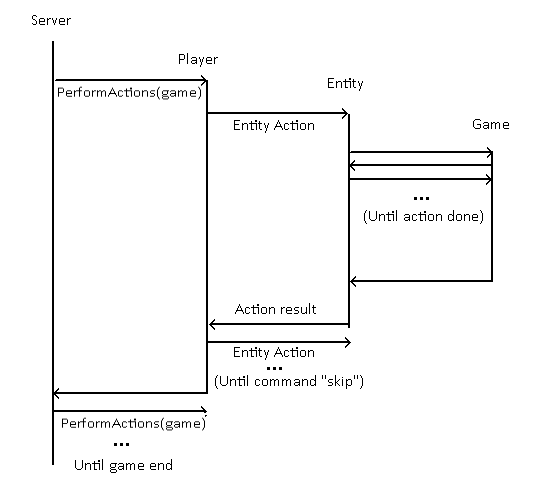

## Основные компоненты
- Сервер - реализуется классом Server. Обрабатывает запросы игроков.
- Игроки - модули, реализующие общение с сервером и (если задумано) интерфейс взаимодействия с пользователем (игром может быть и ботом, т. е. без интерфейса)

[Обоснование: Клиент-серверный подход позволяет абстрагироваться от того, является ли игрок ботом, локальным или сетевым игроком]

### Server
[UPD: НЕ синглетон - мало ли, я много захочу]
Следит за очерёдностью ходов и окончанием игры
#### Game <>- Server
Непосредственно занимается игровой логикой. Хранит игровую инвормацию об игроках, обрабатывает их запросы.
#### Entity <>- Game
Всё то, что может выполнять команды и имеет здоровье
#### Building (Entity) <>- Game
Один из классов игровых обьектов, пока имеющий только одного представителя - замок (Fortress)
#### Unit (Entity, final) <>- Game
[Не знаю, можно ли это считать прототипом, если сборка происходит динамически и нет клонирования. Наследование не планируется, т. к. разнообразие достигается модулями]
Класс, представляющий юнитов. Хранит статы как словарь по названиям для удобства изменения. При инициализации получает список модулей и по ним устанавливает статы. Дальше достаточно хранить только имена модулей для ответа на запросы. 
##### UnitModuleType(Enum) <>- UnitModule, Unit

##### UnitModule <- Unit
[А вот это уже точно прототип. Клонирует заготовки модулей из статического словаря. Каждой заготовке соответствует уникальный UnitModuleType]
Хранит статический словарь с готовыми UnitModule. Объект класса содержит список несовместимых типов модулей и словарь изменения статов юнита. Модули несут только данные - всей логикой занимается юнит.

### Player
Абстрактный класс, поддерживающий метод **PerformActions(World)**

### ConsolePlayer (Player)
Консольная реализация 

